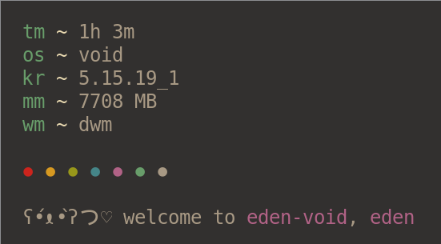

# edenfetch

<p align="center">
  
</p>

## Introduction

edenfetch is a minimal fetch program written in rust. inspired by [jfetch](https://github.com/jimmysit0/jfetch).

## Installation

```bash
git clone https://github.com/edenqwq/edenfetch
cd edenfetch/
cargo install --path .
```

## Usage
```bash
USAGE:
    edenfetch [OPTIONS]

OPTIONS:
    -d, --decor <COLOR_DECORATION>    Set a string to print as color decoration [default: ]
    -e, --emoticon <EMOTICON>         Set a string to print as emoticon [default: ʕ•́ᴥ•̀ʔっ♡]
    -h, --help                        Print help information
    -V, --version                     Print version information
```
