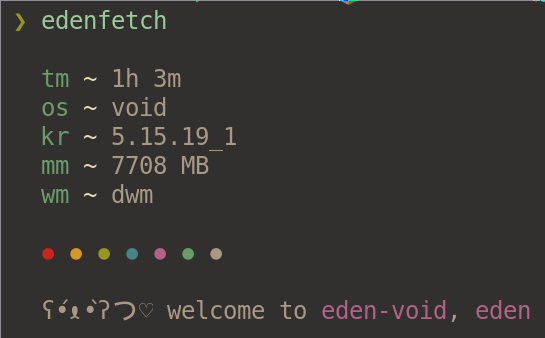

# edenfetch



## Introduction

edenfetch is a minimal fetch program written in Rust. Inspired by [jfetch](https://github.com/Jimmysit0/jfetch).

## Installation

```bash
git clone https://github.com/edenqwq/edenfetch
cd edenfetch/
cargo install --path .
```
